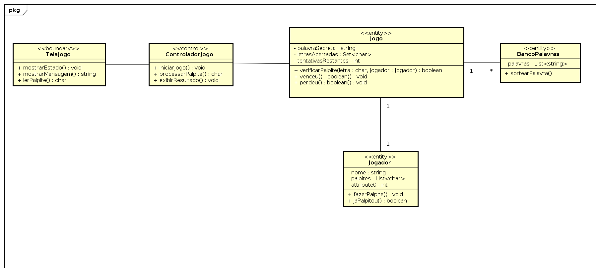

# Jogo da Forca

Exercício da disciplina **Projeto Detalhado de Software**, no qual foi solicitado:

- Criar um diagrama de classes UML para implementar um jogo da forca
- A implementação poderia ser feita em qualquer linguagem (usei **Java com POO**)

##  Estrutura de Pastas

- `src/` → código-fonte
- `lib/` → dependências
- `docs/` → diagramas e documentação
- `README.md` → este arquivo

## Como Executar
- Dê um git clone no rep e seja feliz

##  Diagrama de Classe

